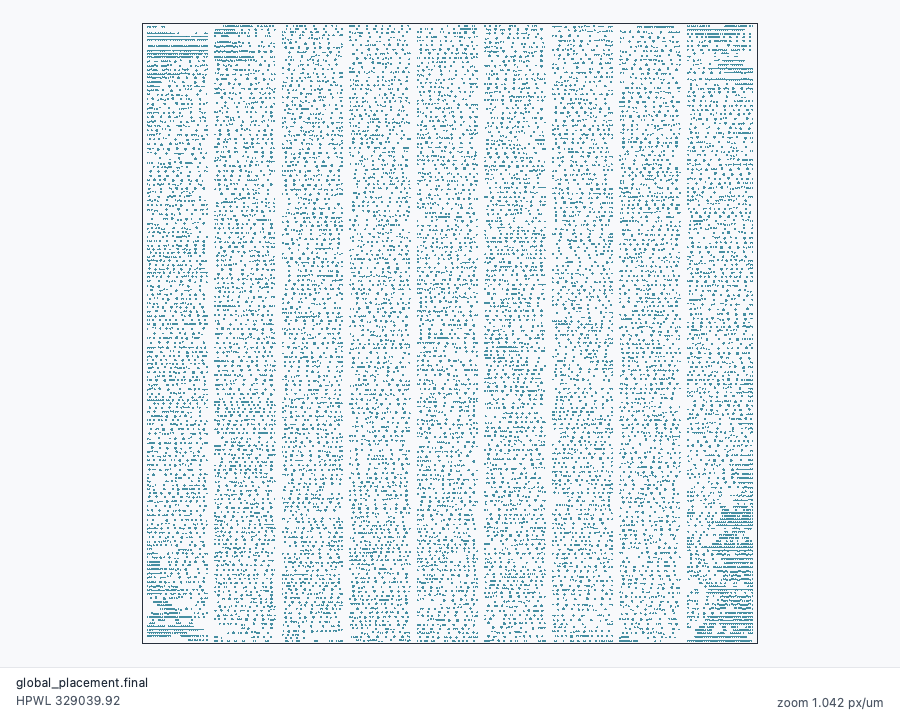
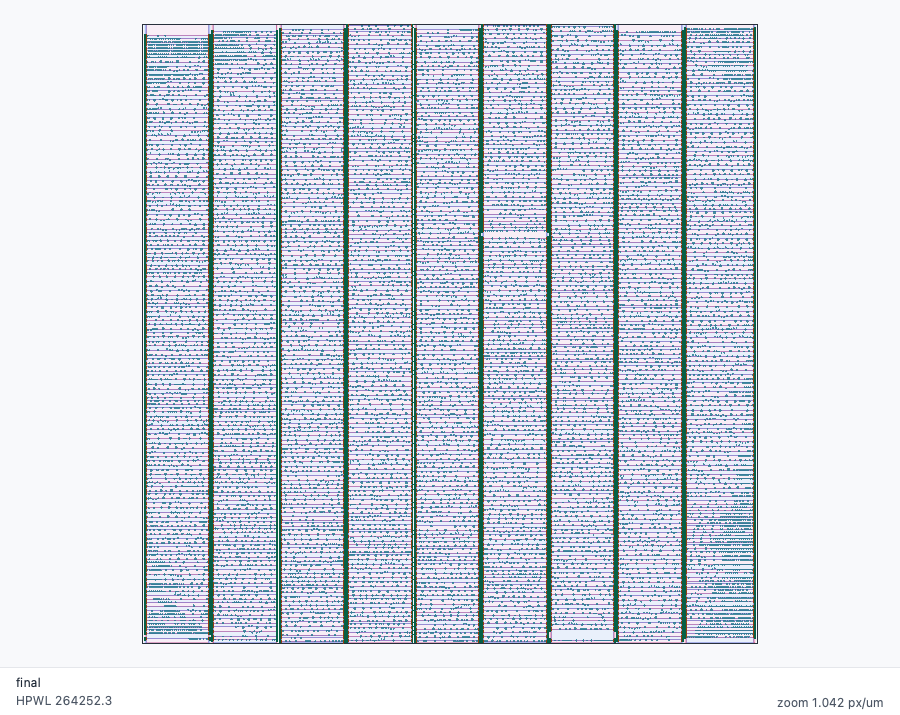
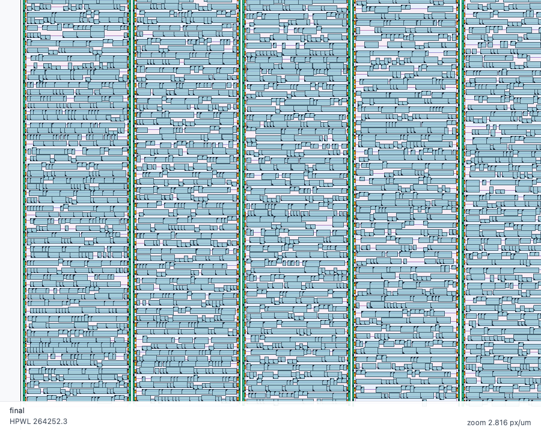
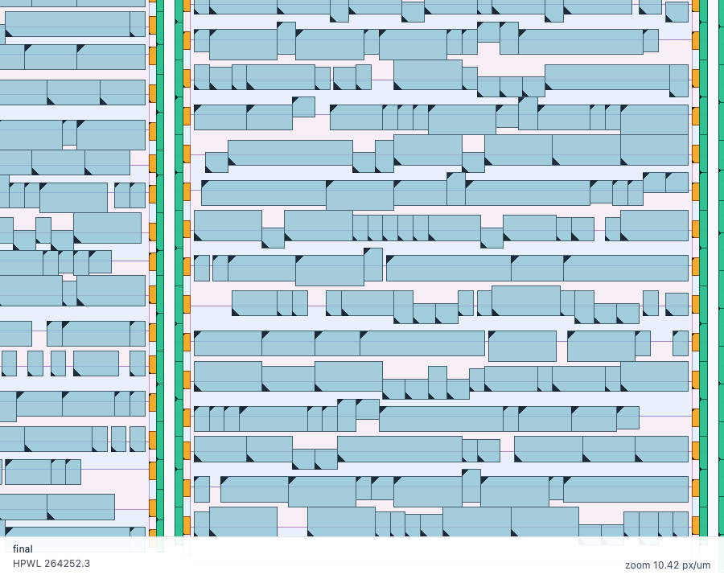
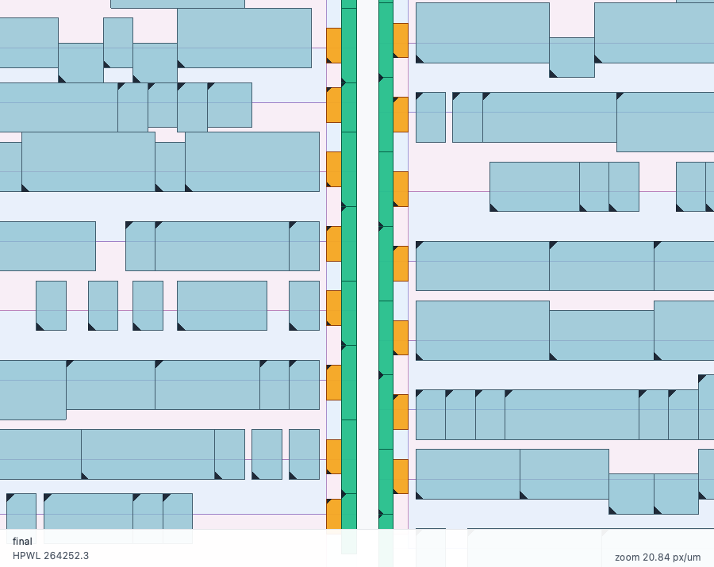

# Live placement GUI

Dali can step through a placement live in a Qt window, showing a snapshot at
every stage: global-placement iterations, gridded stripe partitioning, component
clustering, orientation, row-location and detailed-placement steps, and physical
completion (well taps and end caps).

Requires a Qt-enabled build. Add the flags to any placement command:

    $ dali \
        -lef design.lef \
        -def design.def \
        -cell design.cell \
        -gui_debug \
        -gui_pause every_snapshot

  * `-gui_debug` — open the window and publish snapshots to it
  * `-gui_pause <every_snapshot/off>` — pause at each checkpoint, default
    `every_snapshot`. With `off` the run streams through without waiting.

Pausing lets intermediate state be inspected as it is built. The window also
plots per-stage HPWL curves.

## What it shows

Global placement finishes with cells spread by density and no row structure —
each dot is one movable cell:

After legalization the same design is organised into stripe columns, with the
P and N wells of the gridded rows shown in pink and blue:

Zooming in resolves individual rows across a few stripe columns:

Zoomed further, cells are drawn as rectangles with a corner marker showing
orientation, and the well taps are orange:

At a column boundary: cells, orange well taps, green end caps, and the spacing
between columns:

Regenerate all of these with [images/capture.sh](images/capture.sh), which
drives the capture hook described below.

## Controls

Mouse wheel zooms, left-drag pans. Controls are split by what they act on:

  * **Run** — pause at every snapshot, Step, Continue, and Save PNG
  * **View** — movable dots, I/O pins, delay lines, ACT-added cells, the two
    displacement overlays, and Fit

The **Delay lines** checkbox is off by default, preserving the ordinary view.
When enabled, cells belonging to a registered delay line are orange and dashed
red edges connect consecutive cells in the ordered chain. The edges are
snapshot metadata from the placement engine, so they continue to show the
structured perturbation as the chain moves between rows. Set
`DALI_GUI_SHOW_DELAY_LINES=1` (or `true`) before launching for unattended
captures.

The **Added cells** checkbox is also off by default. When enabled, components
introduced by an ACT-authoritative topology change are cyan. The topology
change publishes `topology_change.request` before the host mutates ACT and
`topology_change.seeded` after the returned delta has been applied and its new
cells seeded. Later legalization and final snapshots retain the same membership,
so animation shows each new cell moving from its local seed to its legal site.
Set `DALI_GUI_SHOW_TOPOLOGY_ADDED=1` (or `true`) for unattended captures.

## Interactive signoff

Combine `-gui_debug` with `-interactive` to use the terminal for commands while
the Qt window monitors the design:

    $ dali \
        -lef design.lef \
        -def placed.def \
        -gui_debug \
        -interactive

Placed I/O pins are drawn above cells. Fixed pins are magenta and other placed
pins are blue; the **I/O pins** checkbox toggles the layer. Successful
placement-changing commands such as `move-io` publish a fresh snapshot. The
window remains responsive while the prompt waits for input and stays open
until the session ends and the window is closed.

## Displacement overlays

Two independent toggles, both off by default, draw an arrow per movable cell
from where it sat earlier to where it sits now. Either or both can be enabled.

  * *Displacement vs global* (red) — total movement since global placement
    finished. Empty while global placement is still running.
  * *Displacement vs previous* (blue) — movement from the current stage alone.

Arrows are drawn to scale, so late stages that move cells by a fraction of a row
need zooming in to see.

## Capturing screenshots

The GUI can write PNGs of chosen snapshots unattended, which is how the images
above are produced. Off unless `DALI_GUI_CAPTURE` is set.

    DALI_GUI_CAPTURE="<dir>;<stem>@<snapshot id>:<region>;..."
    DALI_GUI_CAPTURE_SIZE="<width>x<height>"

Each request writes `<dir>/<stem>.png` when the named snapshot arrives, so one
snapshot can be captured at several zoom levels. `<region>` is `fit` for the
whole design, or `<fx0>,<fy0>,<fx1>,<fy1>` as fractions of the design bounding
box. Append `+cells` to draw cells as rectangles instead of dots.

Further suffixes, in any order: `+window` grabs the whole window rather than
the canvas, `+timing` grabs the diagnostics pane, `+select=<line>:worst` or
`+select=<line>:#<id>` chooses which constraint the frame shows, and `+fade`
ticks Fade unrelated for that frame and unticks it afterwards. A frame with a
selection also writes `<dir>/<stem>.inspector.txt`, the inspector's own words
beside the picture.

Set `QT_QPA_PLATFORM=offscreen` to run without a display.
Capture mode closes the Qt window after placement finishes, allowing a calling
flow to continue with timing reports and artifact export. Without
`DALI_GUI_CAPTURE`, the final window remains open until the operator closes it.

`DALI_GUI_SHOW_DELAY_LINES=1` and `DALI_GUI_SHOW_TOPOLOGY_ADDED=1` can be
combined with `DALI_GUI_CAPTURE` when the captured image should include the
delay-line and topology-added-cell layers.
