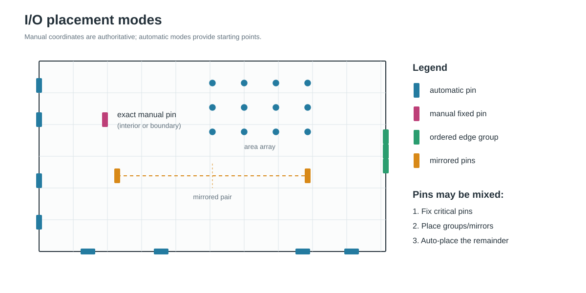
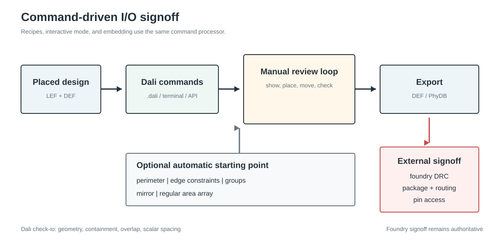

# I/O placement

Dali's supported I/O-placement contract is **direct user control**: a user can
place any I/O pin at an explicit location, inspect it, move it, release it, run
basic checks, and export the result. Automatic perimeter and area-array
placement are convenience heuristics that provide a sensible starting point;
they are not a replacement for package-aware planning or foundry signoff.

The same commands work in a `.dali` recipe, at the interactive prompt, and
through the public command-processor API. The Qt window can display command
results, but commands remain text based so a reviewed flow is reproducible.



The diagrams in this README are generated by
[`images/gen_io_placer_diagrams.py`](images/gen_io_placer_diagrams.py) using
only the Python standard library.

## Manual placement

This recipe loads an existing placement, fixes two pins at user-selected
locations, checks the result, and writes a DEF:

```text
# io_signoff.dali
read-lef "design.lef"
read-def "placed.def"

place-io -place clock M4 -0.5 -2.0 0.5 2.0 120.0 150.0 N
place-io -place reset M4 -0.5 -2.0 0.5 2.0 680.0 225.0 N

show-io
check-io
write-def "io_signed_off.def"
```

Run it reproducibly:

```sh
dali -script io_signoff.dali
```

Or open an already placed design for an inspect-edit-check loop:

```sh
dali -lef design.lef -def placed.def -interactive -o io_signed_off
```

```text
dali> show-io clock
dali> move-io clock 125.0 175.0 N
dali> check-io
dali> write-def "io_signed_off.def"
dali> quit
```

All coordinates supplied to I/O commands are in microns. In `place-io -place`,
`lx ly ux uy` define the pin rectangle relative to its origin, while `x y` give
the absolute origin. Explicitly placed and moved pins become `FIXED`, so a later
automatic pass does not overwrite them.

## Commands

### Manual control

| Command | Purpose |
|---|---|
| `place-io -place <pin> <metal> <lx> <ly> <ux> <uy> <x> <y> <orient>` | Set the layer, shape, exact location, and orientation of one pin; mark it fixed. |
| `move-io <pin> <x> <y> [orient]` | Move and fix a pin while preserving its current layer and shape. |
| `unfix-io <pin>` | Mark a pin unplaced so a later automatic pass may replace it. |
| `show-io [pin]` | Report one pin or all I/O pins. |
| `check-io` | Run Dali's lightweight geometry checks. |
| `write-def [output]` | Export the current placement to DEF. |

The orientations accepted by Dali are `N`, `S`, `E`, `W`, `FN`, `FS`, `FE`,
and `FW`.

### Convenience placement

| Command | Purpose |
|---|---|
| `place-io <metal>` | Place all remaining pins around the four die edges on one layer. |
| `place-io -constraint <pin\|dir:DIR> <edge>` | Constrain one pin or signal direction to `left`, `right`, `bottom`, or `top`. |
| `place-io -group <metal> <edge> <pin> [pin ...]` | Place an ordered adjacent run of pins on one edge. |
| `place-io -mirror <pin> <reference> <x\|y>` | Reflect a pin from an already placed reference across a die centerline. |
| `place-io -area <metal> <rows> <cols>` | Assign remaining pins to an interior rectangular lattice. |
| `place-io -config ...` | Configure the layers used by a later automatic perimeter pass. |
| `place-io -auto-place` | Run automatic perimeter placement with the current configuration. |

Manual and automatic operations can be combined. A common flow fixes clocks,
resets, buses, and package-constrained pins first, then automatically places
the remainder.



## What `check-io` checks

`check-io` is an early consistency check. It reports:

- unplaced pins;
- pins without a layer or rectangle;
- rectangles extending outside the die;
- same-layer rectangle overlap; and
- same-layer violations of the layer's scalar minimum spacing.

A passing result means only that these checks passed. It does not certify that
the pins satisfy a complete process design-rule deck.

## Limitations

| Area | Current limitation |
|---|---|
| Foundry DRC | Dali does not evaluate spacing tables, end-of-line rules, width-dependent spacing, enclosure, via, track, pin-access, or routing-blockage rules. Run the exported design through the normal physical-verification and routing flow. |
| Package and routing objectives | Automatic placement does not model bump/package connectivity, escape routing, congestion, timing, power integrity, or signal integrity. |
| Automatic perimeter capacity | Placement is heuristic. Dense or heavily constrained edges can require manual correction, followed by `check-io`. |
| Metal resources | Automatic boundary placement currently uses a simple per-boundary layer model rather than a full multi-layer track-capacity model. |
| Edge constraints | A constraint selects a complete die edge; edge ranges and keep-out intervals are not exposed as user constraints. |
| Area arrays | Sites form a regular rectangular lattice; irregular bump maps and reserved bump classes are not modeled. |
| Unconnected pins | Automatic modes may skip pins that have no connected component from which to infer a preferred location. Place such pins explicitly when needed. |

These limitations are intentional for the current scope. The user-specified pin
location is authoritative; Dali provides editing, persistence, a basic sanity
check, and convenient initial layouts.

## GUI and integration

With `-interactive -gui_debug`, placement-changing commands publish a new Qt
snapshot after they succeed. The GUI is an observer, while the terminal remains
the command surface:

```sh
dali \
  -lef design.lef \
  -def placed.def \
  -interactive \
  -gui_debug \
  -o io_signed_off
```

Embedding applications can invoke the same behavior through
`Dali::ExecuteCommand`, `Dali::ExecuteCommandLine`, or
`Dali::RunCommandFile`. Commands may optionally use the `dali:` namespace, for
example `dali:place-io` and `dali:check-io`.

## Tests

Focused command and integration tests live in
[`tests/placer/io_placer`](../../../tests/placer/io_placer). From the build
directory, run:

```sh
ctest --output-on-failure -L io_placer
```
