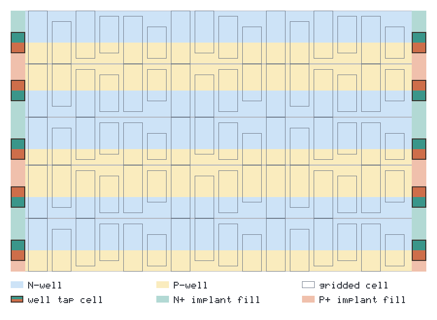
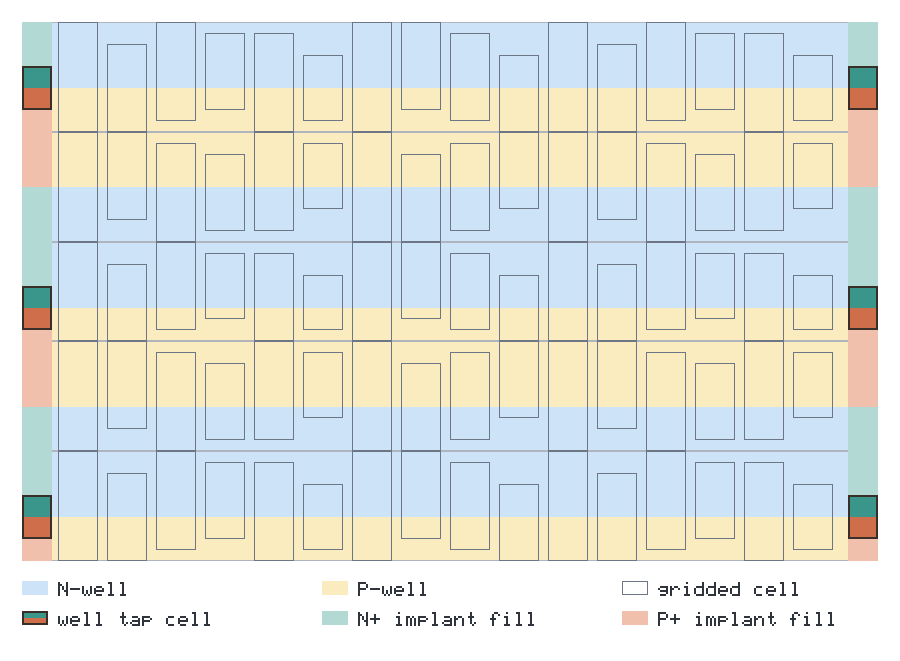
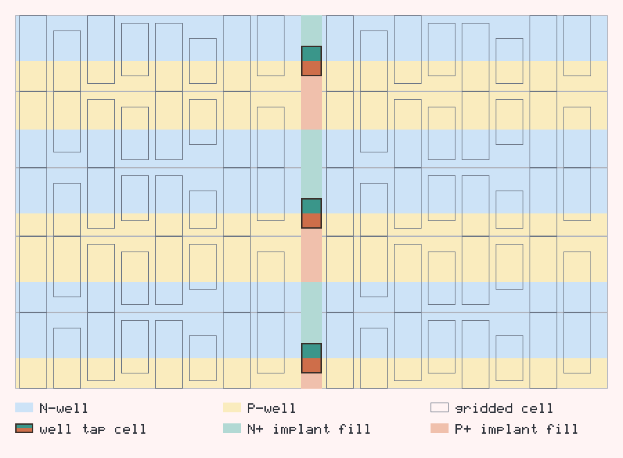
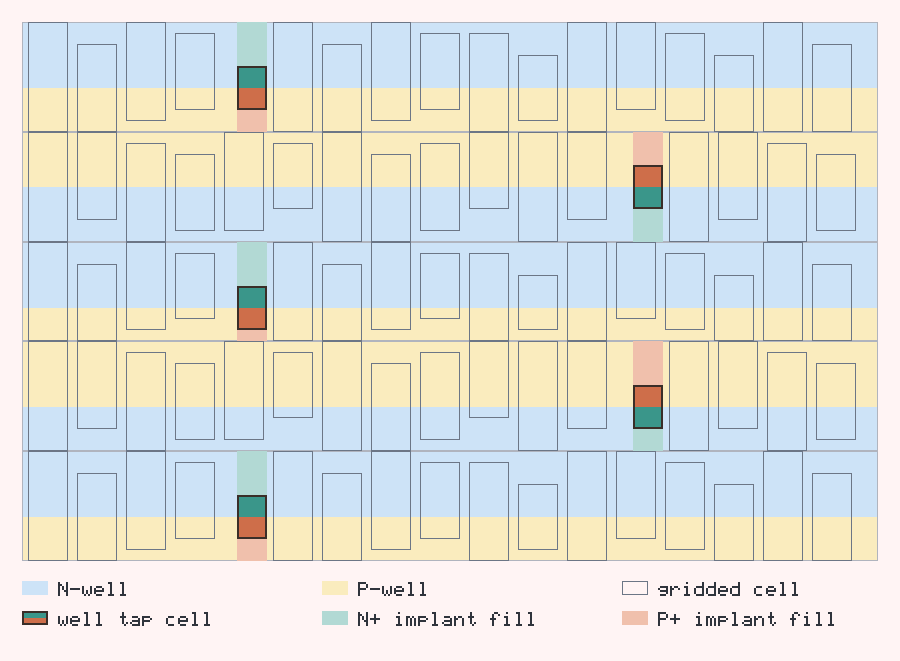

# Well-Tap Placement Patterns (gridded flow)

The gridded well legalizer inserts **well-tap cells** so that every transistor
sits within `MaxPlugDist` of a compatible-well tap — the latch-up rule. The
`-well_tap_pattern` option selects how those taps are arranged in each row.

Whatever the pattern, a **pattern-agnostic coverage check**
(`GriddedPlacementValidator`) verifies the `MaxPlugDist` rule geometrically, so
correctness never depends on a pattern's own bookkeeping. Legend for the
diagrams below: **orange = well-tap cell**, **blue = ordinary cell**.

## Taxonomy

Row-based patterns factor into two independent axes; **checkerboard** is a
standalone 2-D pattern that already fixes both axes and takes no cadence.

| Axis | Choices | Meaning |
|------|---------|---------|
| Position | `row-end` \| `row-mid` | *where* in the row taps sit |
| Cadence | every row \| every other row | *which* rows get taps |

`row-end` taps live in the reserved row-end margins. A `row-mid` tap sits at the
center and effectively **splits the row into two equal-height segments** that
abut at the tap; cells legalize within a segment and cannot cross the tap.

## Supported (gridded)

| Pattern | `-well_tap_pattern` | Status |
|---|---|---|
| **row-end, every row** — two taps per row, in the margins (the default) | `row-end` | Available |
| **row-end, every other row** — row-end taps on alternate rows; untapped rows covered by their neighbors | `row-end-every-other` | Planned; pending well-implant geometry generalization |
| **row-mid, every row** — one center tap per row; the column is split into two independent segments at the seam | `row-mid` | Planned |

Pattern names are `<position>` with an optional `-every-other` cadence suffix
(default cadence is every row). `every-other-row` is accepted as a legacy alias
for `row-end-every-other`.

<br>
`row-end`, every row

<br>
`row-end-every-other`

<br>
`row-mid`, every row — the center tap splits each row into two segments

## Not supported (gridded)

| Pattern | Reason |
|---|---|
| **row-mid, every other row** | The center seam becomes intermittent (only some rows carry the tap), so the column can no longer be split uniformly; it would require per-row splitting with an explicit row-adjacency model. Low return for narrow gridded stripes. |
| **checkerboard** | Staggered interior taps pay off only in *wide* rows. Gridded stripes are ≈`MaxPlugDist` wide, so row-end/row-mid taps already over-satisfy the rule (measured worst gap ≈ 32 µm vs a 75 µm budget). No benefit to justify the varying-column geometry. |

<br>
row-mid, every other row — not supported

<br>
checkerboard — not supported for gridded

## Selecting a pattern

```bash
dali ... -well_tap_pattern row-end               # default
dali ... -well_tap_pattern row-end-every-other
```

## Note on the standard-cell flow

Checkerboard *is* implemented for the standard-cell tap-insertion path
(`Stripe::PrecomputeWellTapCellLocation`, `is_checkerboard_mode_`), where rows
are much wider than `MaxPlugDist` and staggered interior taps genuinely reduce
tap count. It is intentionally **not** offered for the gridded flow for the
reason in the table above.
