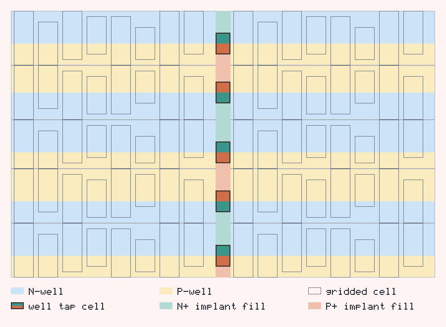

# Well-Tap Placement Patterns (gridded flow)

The gridded well legalizer inserts **well-tap cells** so that every transistor
sits within `MaxPlugDist` of a compatible-well tap — the latch-up rule. The
`-well_tap_pattern` option selects how those taps are arranged in each row.

Whatever the pattern, a **pattern-agnostic coverage check**
(`GriddedPlacementValidator`) verifies the `MaxPlugDist` rule geometrically, so
correctness never depends on a pattern's own bookkeeping.

Each diagram carries its own legend along the bottom. The P+/N+ layer is called
the *implant* layer throughout, matching the code (`AppendImplantRects`,
`include_implants`) and the `pplus`/`nplus` rectangles Dali writes out; some
PDKs call the same layer "select".

A well-tap cell is **short** — it cannot span a row — so it straddles the row's
P/N boundary to tie both wells at once: its N+ side ties the N-well to VDD, its
P+ side ties the substrate to VSS. Because the tap is short, the rest of that tap
column is covered by the lighter implant tones: above the tap, below it, and
across any row a pattern leaves untapped. That fill is generated by
`WellGeometryBuilder` and is required, not cosmetic — see the DRC requirements
below.

Cell and row heights deliberately differ. Gridded cells are quantized in height,
not width, so the cells drawn here share one width and vary their P-well and
N-well extents; each is aligned on its row's P/N boundary, the way abutting power
rails force them to be. A row is exactly tall enough for the tallest cell
clustered into it, which is why gridded row heights are uneven and each row's P/N
boundary sits at a different offset — unlike uniform standard-cell rows. Adjacent
rows are flipped so like wells abut across the row boundary.

The diagrams are generated by [`images/gen_tap_diagrams.py`](images/gen_tap_diagrams.py)
(Python stdlib only); rerun it there to regenerate them.

## DRC-clean requirements

Everything a tap pattern must satisfy for the output to be DRC clean. New
patterns have to keep all of these true.

| # | Requirement | How it is met |
|---|---|---|
| 1 | **Latch-up / MaxPlugDist coverage.** Every movable cell must lie within `MaxPlugDist` of a compatible-well tap. | Checked geometrically per stripe by `GriddedPlacementValidator` (`check_well_tap_coverage`), independent of the pattern. A violation makes the placement illegal and is logged at error severity. |
| 2 | **P+/N+ implant continuity.** The implant layer (`pplus`/`nplus`) must be continuous; a gap causes minimum-implant-area, notch and spacing violations. | A tap is short, so `WellGeometryBuilder` fills the remainder of every tap column — above the tap, below it, and across untapped rows — following the well banding. This is why filler cells exist in a conventional flow. |
| 3 | **N-well continuity.** Wells must be continuous across a row. | Well filling rects span the full stripe regardless of where taps land. |
| 4 | **A tap must tie both wells.** N-well to VDD, substrate to VSS. | The tap straddles the row's P/N boundary, N+ on the N-well side and P+ on the P-well side. |
| 5 | **Like wells must abut.** N-well meets N-well and P-well meets P-well across a row boundary, or well-spacing rules are violated. | Adjacent rows are flipped, which is also why well bands read as uneven double-height stripes. |
| 6 | **Boundary space must be reserved.** Rows need room for end caps and row-end taps. | `RowTapPlacer::ValidateRow` fails fast if a row did not reserve enough, rather than letting a cell overlap a tap. |
| 7 | **Correct implant type per well.** P+ over P-well, N+ over N-well in a tap column; the opposite over the cell area (N+ over P-well for NMOS, P+ over N-well for PMOS). | Both implant passes walk the same P/N banding, so the layer follows the well rather than a per-gap toggle. |

Requirement 2 is the one that is easy to get wrong: it is not enough to place a
tap correctly, the implant layer around it must be left gap-free.

## Taxonomy

Row-based patterns factor into two independent axes; **checkerboard** is a
standalone 2-D pattern that already fixes both axes and takes no cadence.

Supported patterns place taps in the reserved **row-end margins** and differ only
in cadence — which rows carry them.

| Axis | Choices | Meaning |
|------|---------|---------|
| Position | `row-end` | *where* in the row taps sit |
| Cadence | every row \| every other row | *which* rows get taps |

A tap placed anywhere other than a row end (`row-mid`, checkerboard) sits inside
the row, which is what makes it unsupported — see below.

## Supported (gridded)

| Pattern | `-well_tap_pattern` | Status |
|---|---|---|
| **row-end, every row** — two taps per row, in the margins (the default) | `row-end` | Available |
| **row-end, every other row** — row-end taps on alternate rows; untapped rows covered by their neighbours | `row-end-every-other` | Available |

Pattern names are `<position>` with an optional `-every-other` cadence suffix
(default cadence is every row). `every-other-row` is accepted as a legacy alias
for `row-end-every-other`.

### `row-end` — two taps per row


Every row gets a tap in each reserved end margin. Since a tap is short, the rest
of both tap columns is implant fill.

### `row-end-every-other` — taps on alternate rows


Half the taps. Untapped rows rely on their neighbours' taps for latch-up
coverage, and their tap columns are entirely implant fill.

## Not supported (gridded)

| Pattern | Reason |
|---|---|
| **row-mid** (one centred tap per row) | A tap inside the row must have space reserved for it *before* legalization, but the gridded flow places cells across one contiguous interval per row (`LegalizeCompactX` / `LegalizeLooseX`, bounded only by the row-end margins), and the detailed placer assumes the same. Reserving it afterwards instead freezes cell order and drifts the tap off centre, so the attempt was removed. Supporting it means making the row packers, row capacity, and the detailed placer's bounds gap-aware. |
| **row-mid, every other row** | The center seam becomes intermittent (only some rows carry the tap), so the column can no longer be split uniformly; it would require per-row splitting with an explicit row-adjacency model. Low return for narrow gridded stripes. |
| **checkerboard** | Staggered interior taps pay off only in *wide* rows. Gridded stripes are ≈`MaxPlugDist` wide, so row-end taps already over-satisfy the rule (measured worst gap ≈ 32 µm vs a 75 µm budget). No benefit to justify the varying-column geometry. |

### row-mid *(not supported)*



One centred tap per row would halve the tap count, but the tap lands *inside* the
row rather than in a reserved margin.

### row-mid, every other row *(not supported)*


The center wall is intermittent, so the column cannot be split uniformly.

### checkerboard *(not supported for gridded)*


Staggered taps need per-row tap columns, and buy nothing at gridded stripe
widths.

## Selecting a pattern

```bash
dali ... -well_tap_pattern row-end               # default
dali ... -well_tap_pattern row-end-every-other
```

On a representative gridded design, `row-end-every-other` halves the tap count at
no wirelength cost, and the coverage check confirms the latch-up rule still
holds:

| | `row-end` | `row-end-every-other` |
|---|---:|---:|
| well-tap cells | 21402 | 10702 |
| final HPWL | 2.77869e6 | 2.77869e6 |
| coverage violations | 0 | 0 |
| worst cell-to-tap gap (75 µm budget) | 32.41 µm | 32.75 µm |

Note that the row-end margins are still reserved on untapped rows, so this saves
tap cells rather than row width; reclaiming that space would be a separate
change.

## Note on the standard-cell flow

Checkerboard *is* implemented for the standard-cell tap-insertion path
(`Stripe::PrecomputeWellTapCellLocation`, `is_checkerboard_mode_`), where rows
are much wider than `MaxPlugDist` and staggered interior taps genuinely reduce
tap count. It is intentionally **not** offered for the gridded flow for the
reason in the table above.
